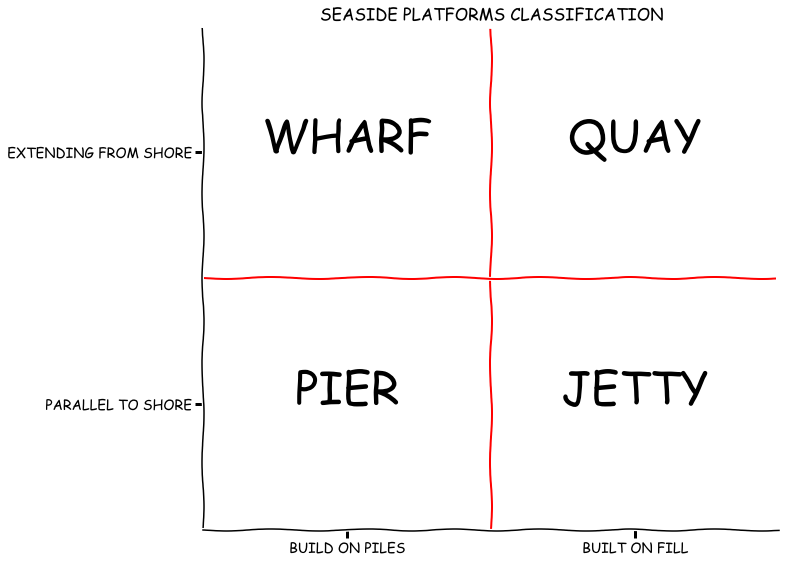

# Fun Fact \#1: Pier, Wharf, Jetty or Quay?


```python
%matplotlib inline
from matplotlib import pyplot as plt
plt.xkcd()

fig = plt.figure(figsize=[10, 10])
ax = fig.add_axes((0.1, 0.2, 0.8, 0.7))
ax.spines['right'].set_color('none')
ax.spines['top'].set_color('none')
ax.xaxis.set_ticks_position('bottom')
ax.set_xticks([-5, 5])
ax.set_yticks([-5, 5])
ax.set_xlim([-10, 10])
ax.set_ylim([-10, 10])
ax.set_xticklabels(['Build on Piles'.upper(), 'Built on Fill'.upper()])
ax.set_yticklabels(['Parallel to Shore'.upper(), 'Extending from Shore'.upper()])
plt.title("Seaside Platforms Classification".upper())
plt.axvline(0, color='r')
plt.axhline(0, color='r')

ax.text(5, 5, 'QUAY',ha='center', fontsize=45)
ax.text(-5, 5, 'WHARF',ha='center', fontsize=45)
ax.text(5, -5, 'JETTY',ha='center', fontsize=45)
ax.text(-5, -5, 'PIER',ha='center', fontsize=45)

```





```python
from IPython.display import HTML
HTML('''<script>
code_show=true; 
function code_toggle() {
if (code_show){
$('div.input').hide();
 } else {
 $('div.input').show();
 }
 code_show = !code_show
} 
$( document ).ready(code_toggle);
</script>
The raw code for this IPython notebook is by default hidden for easier reading.
To toggle on/off the raw code, click <a href="javascript:code_toggle()">here</a>.
''')

```


<script>
code_show=true; 
function code_toggle() {
if (code_show){
$('div.input').hide();
 } else {
 $('div.input').show();
 }
 code_show = !code_show
} 
$( document ).ready(code_toggle);
</script>
The raw code for this IPython notebook is by default hidden for easier reading.
To toggle on/off the raw code, click <a href="javascript:code_toggle()">here</a>.


```python

```
